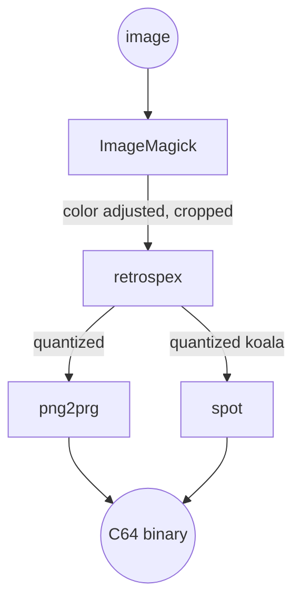

# retrospex

Converts an image to match Commodore 64 graphic modes specifications.
Designed to be used as part of a development toolchain, for example together with other tools like:

- [ImageMagick](https://imagemagick.org/index.php)
- [png2prg](https://github.com/staD020/png2prg). retrospex is specifically designed for compatibility with `png2prg`
- [spot](https://github.com/spartaomg/spot_cpp)

## Example toolchain



## Usage

```bash
Usage: retrospex [options] input.png

Options:

	-o
		Output filename (default out.png)
	-m
		Graphics mode. (default koala), One of mixedcharset,mccharset,sccharset,koala,hires
	-p
		Palette (default colodore). One of archmage,ste,perplex_1,colodore,vice,vice_old_lum,vice_371_internal,pantaloon,lenyn,pepto,electric,perplex_2
	-dm
		Dither matrix (default bayer2x2). One of none,bayer2x2,bayer4x4,bayer8x8
	-dd
		Dither depth (default 20). 0-255
```
