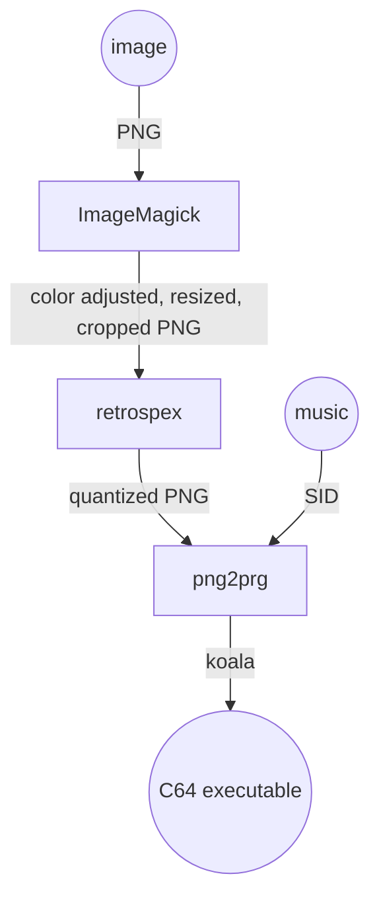

# retrospex

Converts an image to match Commodore 64 graphic modes specifications.
Designed to be used as part of a development toolchain, for example together with other tools like:

- [ImageMagick](https://imagemagick.org/index.php)
- [png2prg](https://github.com/staD020/png2prg). retrospex is specifically designed for compatibility with `png2prg`
- [spot](https://github.com/spartaomg/spot_cpp)

## Usage

```bash
Usage: retrospex [options] input.png

Options:

	-o
		Output filename (default out.png)
	-m
		Graphics mode. (default koala), One of sccharset,mcibitmap,koala,hires,mixedcharset,mccharset
	-p
		Palette (default colodore). One of archmage,perplex_1,lenyn,colodore,vice_old_lum,vice_371_internal,electric,ste,perplex_2,pepto,vice,pantaloon
	-dm
		Dither matrix (default bayer4x4). One of bayer4x4,bayer8x8,none,bayer2x2
	-dd
		Dither depth (default 25). 0-255
```

## Example toolchain



Create a c64 executable from `madonna.png` with music `Whos_That_Girl.sid`:

```bash
#!/bin/bash
INPUT=madonna

# use https://imagemagick.org to resize and normalize source image
convert ${INPUT}.png -normalize -resize 320x200^ -gravity center -extent 320x200 ${INPUT}01.png

# use retrospex to convert to c64 specs
retrospex -m koala -o ${INPUT}02.png ${INPUT}01.png

# use https://github.com/staD020/png2prg to convert to c64 executable with music
png2prg -v -d -sid Whos_That_Girl.sid ${INPUT}02.png

# open the result in https://vice-emu.sourceforge.io/
x64sc ${INPUT}02.prg
```
